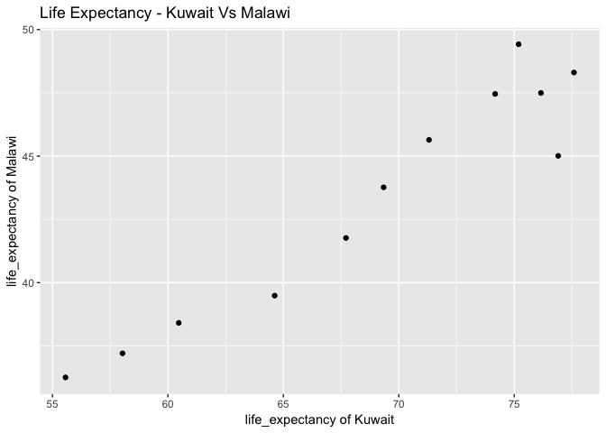

STAT545 Homework 4: Data wrangling with data aggregation and data reshaping
================
Rebecca Asiimwe
2018-10-06

-   [STAT545 Homework 4: Data wrangling with data aggregation and data reshaping](#stat545-homework-4-data-wrangling-with-data-aggregation-and-data-reshaping)
    -   [The dplyr library as a major component of the data analysis ecosystem.](#the-dplyr-library-as-a-major-component-of-the-data-analysis-ecosystem.)
        -   [Loading required packages](#loading-required-packages)
    -   [Qn 1. Data Reshaping Prompt](#qn-1.-data-reshaping-prompt)
        -   [Activity \#2](#activity-2)
        -   [Make a tibble with one row per year and columns for life expectancy for two or more countries.](#make-a-tibble-with-one-row-per-year-and-columns-for-life-expectancy-for-two-or-more-countries.)
        -   [Use knitr::kable() to make this table look pretty in your rendered homework.](#use-knitrkable-to-make-this-table-look-pretty-in-your-rendered-homework.)
        -   [Take advantage of this new data shape to scatterplot life expectancy for one country against that of another.](#take-advantage-of-this-new-data-shape-to-scatterplot-life-expectancy-for-one-country-against-that-of-another.)
    -   [Qn 2. Join Prompt](#qn-2.-join-prompt)
        -   [Activity \#2 :Create your own cheatsheet](#activity-2-create-your-own-cheatsheet)
        -   [Introduction to dplyr's join functions](#introduction-to-dplyrs-join-functions)
        -   [Creating tibble 1](#creating-tibble-1)
        -   [Creating tibble 2](#creating-tibble-2)
    -   [Mutating joins:](#mutating-joins)
        -   [Left Join](#left-join)
        -   [Right Join](#right-join)
        -   [Inner Join](#inner-join)
        -   [Full Join](#full-join)
    -   [Filtering joins:](#filtering-joins)
        -   [Semi Join](#semi-join)
        -   [Anti Join](#anti-join)
        -   [Joining tibbles with respect to some common column name](#joining-tibbles-with-respect-to-some-common-column-name)
    -   [Set Operations:](#set-operations)
    -   [Biding datasets:](#biding-datasets)
        -   [Sources to acknowledge:](#sources-to-acknowledge)

STAT545 Homework 4: Data wrangling with data aggregation and data reshaping
===========================================================================

Data analysis tasks involve 3 main components, `(1) Data Manipulation`, `(2) Data Cleaning` and `(3) Data Visualization`. In my previous assignments, I showed the [application of dply for data exploration and manipulation, followed by visualisation of the data using ggplot2.](https://github.com/STAT545-UBC-students/hw03-rasiimwe/blob/master/hw03-rasiimwe.md). It is estimated that 80% of data analysis tasks are inclined to data manipulation and cleaning. This is attribtued to the growth in data sources that need preparation to efficiently handle this data

The dplyr library as a major component of the data analysis ecosystem.
----------------------------------------------------------------------

[](https://github.com/STAT545-UBC-students/hw04-rasiimwe/blob/master/plugins/dplyr.png)

Herein, I present **the application of the dplyr package in supporting data manipulation operations** for data anlysis. Here we shall focus on manipulating data using functions such as `gather()`, `spread()`, `mutating joins`, `filtering joins`, `set operations` and `biding` datasets.

### Loading required packages

First, I will load all packages required for this assignment

``` r
suppressPackageStartupMessages(library(tidyverse)) 
```

    ## Warning: package 'dplyr' was built under R version 3.5.1

``` r
suppressPackageStartupMessages(library(gapminder))
suppressPackageStartupMessages(library(ggplot2))
suppressPackageStartupMessages(library(knitr))
suppressPackageStartupMessages(library(cowplot))
```

Qn 1. Data Reshaping Prompt
---------------------------

Overview: Problem - You have data in one “shape” but you wish it were in another. Usually this is because the alternative shape is superior for presenting a table, making a figure, or doing aggregation and statistical analysis. Solution: Reshape your data. For simple reshaping, gather() and spread() from tidyr will suffice.

### Activity \#2

> Make a tibble with one row per year and columns for life expectancy for two or more countries. Use knitr::kable() to make this table look pretty in your rendered homework. Take advantage of this new data shape to scatterplot life expectancy for one country against that of another.

### Make a tibble with one row per year and columns for life expectancy for two or more countries.

``` r
countries <- c("Cambodia", "Bulgaria","Malawi", "Kuwait") #selecting countries for inclusion in my tibble

life_expectancy <- gapminder %>%
  filter(country %in% countries) %>% #filtering the gapminder dataset for the four countries in my vector countries
  select(country, year, lifeExp) %>% #selecting variable for inclusion in my tibble life_expectancy
  group_by(year) #choosing to group by year
  
kable(life_expectancy) #applying the kable function to render a neat/ nicely presented table
```

| country  |  year|  lifeExp|
|:---------|-----:|--------:|
| Bulgaria |  1952|   59.600|
| Bulgaria |  1957|   66.610|
| Bulgaria |  1962|   69.510|
| Bulgaria |  1967|   70.420|
| Bulgaria |  1972|   70.900|
| Bulgaria |  1977|   70.810|
| Bulgaria |  1982|   71.080|
| Bulgaria |  1987|   71.340|
| Bulgaria |  1992|   71.190|
| Bulgaria |  1997|   70.320|
| Bulgaria |  2002|   72.140|
| Bulgaria |  2007|   73.005|
| Cambodia |  1952|   39.417|
| Cambodia |  1957|   41.366|
| Cambodia |  1962|   43.415|
| Cambodia |  1967|   45.415|
| Cambodia |  1972|   40.317|
| Cambodia |  1977|   31.220|
| Cambodia |  1982|   50.957|
| Cambodia |  1987|   53.914|
| Cambodia |  1992|   55.803|
| Cambodia |  1997|   56.534|
| Cambodia |  2002|   56.752|
| Cambodia |  2007|   59.723|
| Kuwait   |  1952|   55.565|
| Kuwait   |  1957|   58.033|
| Kuwait   |  1962|   60.470|
| Kuwait   |  1967|   64.624|
| Kuwait   |  1972|   67.712|
| Kuwait   |  1977|   69.343|
| Kuwait   |  1982|   71.309|
| Kuwait   |  1987|   74.174|
| Kuwait   |  1992|   75.190|
| Kuwait   |  1997|   76.156|
| Kuwait   |  2002|   76.904|
| Kuwait   |  2007|   77.588|
| Malawi   |  1952|   36.256|
| Malawi   |  1957|   37.207|
| Malawi   |  1962|   38.410|
| Malawi   |  1967|   39.487|
| Malawi   |  1972|   41.766|
| Malawi   |  1977|   43.767|
| Malawi   |  1982|   45.642|
| Malawi   |  1987|   47.457|
| Malawi   |  1992|   49.420|
| Malawi   |  1997|   47.495|
| Malawi   |  2002|   45.009|
| Malawi   |  2007|   48.303|

As we can see, the tibble is in long format but what we would like to have is a tibble with one row per year and columns for life expectancy for two or more countries. To do this, I apply the spread function as shown below.

``` r
life_expectancy <- life_expectancy %>% 
  spread(key = country, value = lifeExp) #applying the spread function from dplyr to spread selected countries based on lifeExp (value) across the tibble columns
```

### Use knitr::kable() to make this table look pretty in your rendered homework.

Below I show a more tidy and usable tibble using the kable() function

``` r
kable(life_expectancy)
```

|  year|  Bulgaria|  Cambodia|  Kuwait|  Malawi|
|-----:|---------:|---------:|-------:|-------:|
|  1952|    59.600|    39.417|  55.565|  36.256|
|  1957|    66.610|    41.366|  58.033|  37.207|
|  1962|    69.510|    43.415|  60.470|  38.410|
|  1967|    70.420|    45.415|  64.624|  39.487|
|  1972|    70.900|    40.317|  67.712|  41.766|
|  1977|    70.810|    31.220|  69.343|  43.767|
|  1982|    71.080|    50.957|  71.309|  45.642|
|  1987|    71.340|    53.914|  74.174|  47.457|
|  1992|    71.190|    55.803|  75.190|  49.420|
|  1997|    70.320|    56.534|  76.156|  47.495|
|  2002|    72.140|    56.752|  76.904|  45.009|
|  2007|    73.005|    59.723|  77.588|  48.303|

As we can see above, our initial table that was in long format is now in wide and more tidy form to support the building of the required scatter plot for the subsequent section.

### Take advantage of this new data shape to scatterplot life expectancy for one country against that of another.

``` r
 CambodiaVsBulgaria<- life_expectancy %>%
  ggplot(aes(Cambodia, Bulgaria)) +
  geom_point() + ggtitle("Life Expectancy") + theme_gray()+
  labs(title="Life Expectancy CambodiaVsBulgaria",x="life_expectancy of Cambodia", y="life_expectancy of Bulgaria")

 KuwaitVsMalawi<- life_expectancy %>%
  ggplot(aes(Kuwait, Malawi)) +
  geom_point() + ggtitle("Life Expectancy") + theme_gray()+
labs(title="Life Expectancy KuwaitVsMalawi ",x="life_expectancy of Kuwait", y="life_expectancy of Malawi")

plot_grid(CambodiaVsBulgaria,  KuwaitVsMalawi, nrow=1, ncol = 2)
```



Above, we see scatter plots that have been build from the new transformed tibble (life\_expectancy). The shapes that our data takes on may or may not support the kinds of analyses we need. In this case, we wouldnt have been able to create these plots had the data stayed in the long format which further goes to show for the need of data reshaping before futher analysis is done. It also helps to know which data formats support which type of analysis.

Qn 2. Join Prompt
-----------------

Overview: Problem - You have two data sources and you need info from both in one new data object. Solution: Perform a join, which borrows terminology from the database world, specifically SQL.

### Activity \#2 :Create your own cheatsheet

> Create your own cheatsheet patterned after [Jenny’s](http://stat545.com/bit001_dplyr-cheatsheet.html) but focused on something you care about more than comics! Inspirational examples: + Pets I have owned + breed + friendly vs. unfriendly + ??. Join to a table of pet breed, including variables for furry vs not furry, mammal true or false, etc. + Movies and studios…. + Athletes and teams…. You will likely need to iterate between your data prep and your joining to make your explorations comprehensive and interesting. For example, you will want a specific amount (or lack) of overlap between the two data.frames, in order to demonstrate all the different joins. You will want both the data frames to be as small as possible, while still retaining the expository value.

### Introduction to dplyr's join functions

[](https://github.com/STAT545-UBC-students/hw04-rasiimwe/blob/master/plugins/join-venn.png)

Before we dig deeper into the various join functions, I will create the tibbles required to explore that application of these functions

### Creating tibble 1

The idea and data used is derived from the wikipedia page of [preseidents of the United States](https://en.wikipedia.org/wiki/List_of_Presidents_of_the_United_States)

``` r
presidents <- tibble(
  name = c("Donald Trump", "Barack Obama", "George W. Bush", "Bill Clinton","George H. W. Bush", "Ronald Reagan", "Jimmy Carter","Gerald Ford", "Richard Nixon"),
  previous_office = c("Chairman of The Trump Organization", "U.S. Senator from Illinois", "Governor of Texas", "Governor of Arkansas","Vice President of the United States", "Governor of California", "Governor of Georgia","Vice President of the United States", "Vice President of the United States"),
  party=c("Republican", "Democratic", "Republican", "Democratic","Republican", "Republican", "Democratic","Republican", "Republican"),
  in_office=c(2007, 2009, 2001, 1993,1989, 1981, 1977,1974, 1969),
  out_office=c(2021, 2017, 2009, 2001,1993, 1989, 1981,1977, 1974)
)
```

### Creating tibble 2

``` r
parties <- tibble(
  party=c("Republican", "Democratic", "Republican", "Democratic","Republican", "Republican", "Democratic","Republican", "Republican"),
  vice = c("Mike Pence", "Joe Biden", "Dick Cheney", "Al Gore","Dan Quayle", "George H. W. Bush", "Walter Mondale","Nelson Rockefeller", "Gerald Ford")
)
```

Mutating joins:
---------------

**Joining tibbles using mutating functions:**

1.  `left_join`
2.  `right_join`
3.  `inner_join`
4.  `full_join`

### Left Join

[](https://github.com/STAT545-UBC-students/hw04-rasiimwe/blob/master/plugins/left-join.gif)

**Basic syntax:** `left_join(x, y)`

**Join Function:**

left\_join(x, y): keep all x, drop unmatched y:- Return all rows from ‘x’, and all columns from ‘x’ and ‘y’. Rows in ‘x’ with no match in ‘y’ will have ‘NA’ values in the new columns. If there are multiple matches between ‘x’ and ‘y’, all combinations of the matches are returned.

#### left\_join on presidents & parties

``` r
left_join(presidents, parties)
```

    ## Joining, by = "party"

    ## # A tibble: 45 x 6
    ##    name      previous_office         party  in_office out_office vice     
    ##    <chr>     <chr>                   <chr>      <dbl>      <dbl> <chr>    
    ##  1 Donald T… Chairman of The Trump … Repub…      2007       2021 Mike Pen…
    ##  2 Donald T… Chairman of The Trump … Repub…      2007       2021 Dick Che…
    ##  3 Donald T… Chairman of The Trump … Repub…      2007       2021 Dan Quay…
    ##  4 Donald T… Chairman of The Trump … Repub…      2007       2021 George H…
    ##  5 Donald T… Chairman of The Trump … Repub…      2007       2021 Nelson R…
    ##  6 Donald T… Chairman of The Trump … Repub…      2007       2021 Gerald F…
    ##  7 Barack O… U.S. Senator from Illi… Democ…      2009       2017 Joe Biden
    ##  8 Barack O… U.S. Senator from Illi… Democ…      2009       2017 Al Gore  
    ##  9 Barack O… U.S. Senator from Illi… Democ…      2009       2017 Walter M…
    ## 10 George W… Governor of Texas       Repub…      2001       2009 Mike Pen…
    ## # ... with 35 more rows

### Right Join

[](https://github.com/STAT545-UBC-students/hw04-rasiimwe/blob/master/plugins/right-join.gif)

**Basic syntax:** `right_join(x, y)`

**Function**: keep all y, drop unmatched x:- return all rows from ‘y’, and all columns from ‘x’ and y. Rows in ‘y’ with no match in ‘x’ will have ‘NA’ values in the new columns. If there are multiple matches between ‘x’ and ‘y’, all combinations of the matches are returned

#### right\_join on presidents & parties

``` r
right_join(presidents, parties)
```

    ## Joining, by = "party"

    ## # A tibble: 45 x 6
    ##    name       previous_office         party   in_office out_office vice   
    ##    <chr>      <chr>                   <chr>       <dbl>      <dbl> <chr>  
    ##  1 Donald Tr… Chairman of The Trump … Republ…      2007       2021 Mike P…
    ##  2 George W.… Governor of Texas       Republ…      2001       2009 Mike P…
    ##  3 George H.… Vice President of the … Republ…      1989       1993 Mike P…
    ##  4 Ronald Re… Governor of California  Republ…      1981       1989 Mike P…
    ##  5 Gerald Fo… Vice President of the … Republ…      1974       1977 Mike P…
    ##  6 Richard N… Vice President of the … Republ…      1969       1974 Mike P…
    ##  7 Barack Ob… U.S. Senator from Illi… Democr…      2009       2017 Joe Bi…
    ##  8 Bill Clin… Governor of Arkansas    Democr…      1993       2001 Joe Bi…
    ##  9 Jimmy Car… Governor of Georgia     Democr…      1977       1981 Joe Bi…
    ## 10 Donald Tr… Chairman of The Trump … Republ…      2007       2021 Dick C…
    ## # ... with 35 more rows

### Inner Join

[](https://github.com/STAT545-UBC-students/hw04-rasiimwe/blob/master/plugins/inner-join.gif)

**Basic syntax:** `inner_join(x, y)`

**Join Function:**

inner\_join(x, y): : keep only matching:- Return all rows from x where there are matching values in y, and all columns from x and y. If there are multiple matches between x and y, all combination of the matches are returned.

#### inner\_join on presidents & parties

``` r
inner_join(presidents, parties)
```

    ## Joining, by = "party"

    ## # A tibble: 45 x 6
    ##    name      previous_office         party  in_office out_office vice     
    ##    <chr>     <chr>                   <chr>      <dbl>      <dbl> <chr>    
    ##  1 Donald T… Chairman of The Trump … Repub…      2007       2021 Mike Pen…
    ##  2 Donald T… Chairman of The Trump … Repub…      2007       2021 Dick Che…
    ##  3 Donald T… Chairman of The Trump … Repub…      2007       2021 Dan Quay…
    ##  4 Donald T… Chairman of The Trump … Repub…      2007       2021 George H…
    ##  5 Donald T… Chairman of The Trump … Repub…      2007       2021 Nelson R…
    ##  6 Donald T… Chairman of The Trump … Repub…      2007       2021 Gerald F…
    ##  7 Barack O… U.S. Senator from Illi… Democ…      2009       2017 Joe Biden
    ##  8 Barack O… U.S. Senator from Illi… Democ…      2009       2017 Al Gore  
    ##  9 Barack O… U.S. Senator from Illi… Democ…      2009       2017 Walter M…
    ## 10 George W… Governor of Texas       Repub…      2001       2009 Mike Pen…
    ## # ... with 35 more rows

### Full Join

[](https://github.com/STAT545-UBC-students/hw04-rasiimwe/blob/master/plugins/full-join.gif)

**Basic syntax:** `full_join(x, y): keep everything`

**Join Function:**

full\_join(x, y): Return all rows and all columns from both x and y. Where there are not matching values, returns NA for the one missing. This is a mutating join.

#### full\_join on presidents & parties

``` r
full_join(presidents, parties)
```

    ## Joining, by = "party"

    ## # A tibble: 45 x 6
    ##    name      previous_office         party  in_office out_office vice     
    ##    <chr>     <chr>                   <chr>      <dbl>      <dbl> <chr>    
    ##  1 Donald T… Chairman of The Trump … Repub…      2007       2021 Mike Pen…
    ##  2 Donald T… Chairman of The Trump … Repub…      2007       2021 Dick Che…
    ##  3 Donald T… Chairman of The Trump … Repub…      2007       2021 Dan Quay…
    ##  4 Donald T… Chairman of The Trump … Repub…      2007       2021 George H…
    ##  5 Donald T… Chairman of The Trump … Repub…      2007       2021 Nelson R…
    ##  6 Donald T… Chairman of The Trump … Repub…      2007       2021 Gerald F…
    ##  7 Barack O… U.S. Senator from Illi… Democ…      2009       2017 Joe Biden
    ##  8 Barack O… U.S. Senator from Illi… Democ…      2009       2017 Al Gore  
    ##  9 Barack O… U.S. Senator from Illi… Democ…      2009       2017 Walter M…
    ## 10 George W… Governor of Texas       Repub…      2001       2009 Mike Pen…
    ## # ... with 35 more rows

Filtering joins:
----------------

**Joining tibbles using filtering functions:**

1.  `semi_join`
2.  `anti_join`

### Semi Join

[](https://github.com/STAT545-UBC-students/hw04-rasiimwe/blob/master/plugins/semi-join.gif)

**Basic syntax:** `semi_join(x, y)`

**Join Function:**

semi\_join(x, y):return rows from x where there are matching values in y:- Return all rows from x where there are matching values in y, keeping just columns from x. A semi join differs from an inner join because an inner join will return one row of x for each matching row of y, where a semi join will never duplicate rows of x. This is a filtering join.

#### semi\_join on presidents & parties

``` r
semi_join(presidents, parties)
```

    ## Joining, by = "party"

    ## # A tibble: 9 x 5
    ##   name          previous_office              party    in_office out_office
    ##   <chr>         <chr>                        <chr>        <dbl>      <dbl>
    ## 1 Donald Trump  Chairman of The Trump Organ… Republi…      2007       2021
    ## 2 Barack Obama  U.S. Senator from Illinois   Democra…      2009       2017
    ## 3 George W. Bu… Governor of Texas            Republi…      2001       2009
    ## 4 Bill Clinton  Governor of Arkansas         Democra…      1993       2001
    ## 5 George H. W.… Vice President of the Unite… Republi…      1989       1993
    ## 6 Ronald Reagan Governor of California       Republi…      1981       1989
    ## 7 Jimmy Carter  Governor of Georgia          Democra…      1977       1981
    ## 8 Gerald Ford   Vice President of the Unite… Republi…      1974       1977
    ## 9 Richard Nixon Vice President of the Unite… Republi…      1969       1974

### Anti Join

[](https://github.com/STAT545-UBC-students/hw04-rasiimwe/blob/master/plugins/anti-join.gif)

anti\_join(x, y): Return all rows from x where there are not matching values in y, keeping just columns from x. This is a filtering join.

#### anti\_join on presidents & parties

``` r
anti_join(presidents, parties)
```

    ## Joining, by = "party"

    ## # A tibble: 0 x 5
    ## # ... with 5 variables: name <chr>, previous_office <chr>, party <chr>,
    ## #   in_office <dbl>, out_office <dbl>

### Joining tibbles with respect to some common column name

``` r
left_join(presidents, parties)
```

    ## Joining, by = "party"

    ## # A tibble: 45 x 6
    ##    name      previous_office         party  in_office out_office vice     
    ##    <chr>     <chr>                   <chr>      <dbl>      <dbl> <chr>    
    ##  1 Donald T… Chairman of The Trump … Repub…      2007       2021 Mike Pen…
    ##  2 Donald T… Chairman of The Trump … Repub…      2007       2021 Dick Che…
    ##  3 Donald T… Chairman of The Trump … Repub…      2007       2021 Dan Quay…
    ##  4 Donald T… Chairman of The Trump … Repub…      2007       2021 George H…
    ##  5 Donald T… Chairman of The Trump … Repub…      2007       2021 Nelson R…
    ##  6 Donald T… Chairman of The Trump … Repub…      2007       2021 Gerald F…
    ##  7 Barack O… U.S. Senator from Illi… Democ…      2009       2017 Joe Biden
    ##  8 Barack O… U.S. Senator from Illi… Democ…      2009       2017 Al Gore  
    ##  9 Barack O… U.S. Senator from Illi… Democ…      2009       2017 Walter M…
    ## 10 George W… Governor of Texas       Repub…      2001       2009 Mike Pen…
    ## # ... with 35 more rows

It makes sense to want to join the data frames with respect to some common column name. In this case it is clear that the id column is in both data frames. So let’s join the data frames using “id” as a “key”. The question is what to do about the fact that there is no id in df2 corresponding to id number 2. This is why different types of joins exist. Let’s see how they work. We’ll start with the left join: So the left join looks at the first data frame df1 and then attempts to find corresponding “id” values in df2 that match all id values in df1. Of course there are no ids matching 2 or 3 in df2 so what happens ? The left join will insert NAs in the m1.y column since there are no values in df2. Note that there is in fact an id of value 3 in both data frames so it fills in both measurement columns with the values. Also note that since in both data frames there is a column named “m1” so it has to create unique names to accommodate both columns. The “x” and “y” come from the fact that df1 comes before df2 in the calling sequence to left\_join. Thus “x” matches df1 and “y” matches df2.

Set Operations:
---------------

**Functions used for set operations on two tibbles:**

1.  `intersect`
2.  `union`
3.  `setdiff`

Biding datasets:
----------------

1.  `bind_rows`
2.  `bind cols`

``` r
#bind_rows
```

``` r
#bind_cols
```

------------------------------------------------------------------------

### Sources to acknowledge:

[STAT545 Class notes and excercises by Rashedul Islam](https://github.com/rasiimwe/STAT545_participation/blob/master/cm010/cm010-exercise.md)

[Jenny Bryan's Cheatsheet for dplyr join functions](http://stat545.com/bit001_dplyr-cheatsheet.html)

[Garrick Aden-Buie's tidy verbs](https://github.com/gadenbuie/tidyexplain#readme) [R-bloggers](https://www.r-bloggers.com/express-intro-to-dplyr/)
