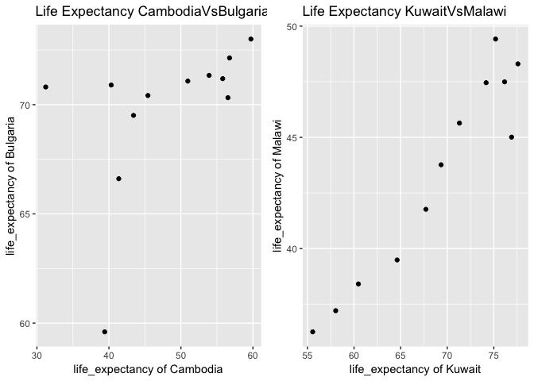

hw04-rasiimwe.rmd
================
Becky
2018-10-06

Homework 4: Data Wrangling with data aggregation and data reshaping
===================================================================

Data Reshaping Prompt (and relationship to aggregation)
-------------------------------------------------------

Overview: Problem - You have data in one “shape” but you wish it were in another. Usually this is because the alternative shape is superior for presenting a table, making a figure, or doing aggregation and statistical analysis. Solution: Reshape your data. For simple reshaping, gather() and spread() from tidyr will suffice.

[](https://github.com/STAT545-UBC-students/hw04-rasiimwe/blob/master/plugins/dplyr.png)

### Activity \#2

> Make a tibble with one row per year and columns for life expectancy for two or more countries. Use knitr::kable() to make this table look pretty in your rendered homework. Take advantage of this new data shape to scatterplot life expectancy for one country against that of another.

### Loading required packages for this assignment

``` r
suppressPackageStartupMessages(library(tidyverse)) 
```

    ## Warning: package 'dplyr' was built under R version 3.5.1

``` r
suppressPackageStartupMessages(library(gapminder))
suppressPackageStartupMessages(library(ggplot2))
suppressPackageStartupMessages(library(knitr))
suppressPackageStartupMessages(library(cowplot))
```

### Make a tibble with one row per year and columns for life expectancy for two or more countries.

``` r
countries <- c("Cambodia", "Bulgaria","Malawi", "Kuwait")

life_expectancy <- gapminder %>%
  filter(country %in% countries) %>%
  select(country, year, lifeExp) %>%
  group_by(year) %>%
  spread(key = country, value = lifeExp)
```

### Use knitr::kable() to make this table look pretty in your rendered homework.

``` r
kable(life_expectancy)
```

|  year|  Bulgaria|  Cambodia|  Kuwait|  Malawi|
|-----:|---------:|---------:|-------:|-------:|
|  1952|    59.600|    39.417|  55.565|  36.256|
|  1957|    66.610|    41.366|  58.033|  37.207|
|  1962|    69.510|    43.415|  60.470|  38.410|
|  1967|    70.420|    45.415|  64.624|  39.487|
|  1972|    70.900|    40.317|  67.712|  41.766|
|  1977|    70.810|    31.220|  69.343|  43.767|
|  1982|    71.080|    50.957|  71.309|  45.642|
|  1987|    71.340|    53.914|  74.174|  47.457|
|  1992|    71.190|    55.803|  75.190|  49.420|
|  1997|    70.320|    56.534|  76.156|  47.495|
|  2002|    72.140|    56.752|  76.904|  45.009|
|  2007|    73.005|    59.723|  77.588|  48.303|

### Take advantage of this new data shape to scatterplot life expectancy for one country against that of another.

``` r
 CambodiaVsBulgaria<- life_expectancy %>%
  ggplot(aes(Cambodia, Bulgaria)) +
  geom_point() + ggtitle("Life Expectancy") + theme_gray()+
  labs(title="Life Expectancy CambodiaVsBulgaria",x="life_expectancy of Cambodia", y="life_expectancy of Bulgaria")

 KuwaitVsMalawi<- life_expectancy %>%
  ggplot(aes(Kuwait, Malawi)) +
  geom_point() + ggtitle("Life Expectancy") + theme_gray()+
labs(title="Life Expectancy KuwaitVsMalawi ",x="life_expectancy of Kuwait", y="life_expectancy of Malawi")

plot_grid(CambodiaVsBulgaria,  KuwaitVsMalawi, nrow=1, ncol = 2)
```



Join Prompts (join, merge, look up)
-----------------------------------

Overview: Problem - You have two data sources and you need info from both in one new data object. Solution: Perform a join, which borrows terminology from the database world, specifically SQL.

### Activity \#2 :Create your own cheatsheet

> Create your own cheatsheet patterned after [Jenny’s](http://stat545.com/bit001_dplyr-cheatsheet.html) but focused on something you care about more than comics! Inspirational examples: + Pets I have owned + breed + friendly vs. unfriendly + ??. Join to a table of pet breed, including variables for furry vs not furry, mammal true or false, etc. + Movies and studios…. + Athletes and teams…. You will likely need to iterate between your data prep and your joining to make your explorations comprehensive and interesting. For example, you will want a specific amount (or lack) of overlap between the two data.frames, in order to demonstrate all the different joins. You will want both the data frames to be as small as possible, while still retaining the expository value.

### Introduction to dplyr join functions

[](https://github.com/STAT545-UBC-students/hw04-rasiimwe/blob/master/plugins/join-venn.png)

Before we dig deeper into the various join functions, I will create the tibbles required to explore that application of these functions

### Creating tibble 1

The idea and data used is derived from the wikipedia page of [preseidents of the United States](https://en.wikipedia.org/wiki/List_of_Presidents_of_the_United_States)

``` r
presidents <- tibble(
  name = c("Donald Trump", "Barack Obama", "George W. Bush", "Bill Clinton","George H. W. Bush", "Ronald Reagan", "Jimmy Carter","Gerald Ford", "Richard Nixon"),
  previous_office = c("Chairman of The Trump Organization", "U.S. Senator from Illinois", "Governor of Texas", "Governor of Arkansas","Vice President of the United States", "Governor of California", "Governor of Georgia","Vice President of the United States", "Vice President of the United States"),
  party=c("Republican", "Democratic", "Republican", "Democratic","Republican", "Republican", "Democratic","Republican", "Republican"),
  in_office=c(2007, 2009, 2001, 1993,1989, 1981, 1977,1974, 1969),
  out_office=c("Incumbent", 2017, 2009, 2001,1993, 1989, 1981,1977, 1974)
)
```

### Creating tibble 2

``` r
parties <- tibble(
  party=c("Republican", "Democratic", "Republican", "Democratic","Republican", "Republican", "Democratic","Republican", "Republican"),
  vice = c("Mike Pence", "Joe Biden", "Dick Cheney", "Al Gore","Dan Quayle", "George H. W. Bush", "Walter Mondale","Nelson Rockefeller", "Gerald Ford")
)
```

Types of mutating joins:
------------------------

Joining tibbles using mutating functions: left\_join, right\_join, inner\_join and full\_join

### Inner Join

[](https://github.com/STAT545-UBC-students/hw04-rasiimwe/blob/master/plugins/inner-join.gif)

**Basic syntax:** `inner_join(x, y): keep only matching`

**Join Function:** inner\_join(x, y): Return all rows from x where there are matching values in y, and all columns from x and y. If there are multiple matches between x and y, all combination of the matches are returned. This is a mutating join.

#### inner\_join on presidents & parties

``` r
inner_join(presidents, parties)
```

    ## Joining, by = "party"

    ## # A tibble: 45 x 6
    ##    name      previous_office         party  in_office out_office vice     
    ##    <chr>     <chr>                   <chr>      <dbl> <chr>      <chr>    
    ##  1 Donald T… Chairman of The Trump … Repub…      2007 Incumbent  Mike Pen…
    ##  2 Donald T… Chairman of The Trump … Repub…      2007 Incumbent  Dick Che…
    ##  3 Donald T… Chairman of The Trump … Repub…      2007 Incumbent  Dan Quay…
    ##  4 Donald T… Chairman of The Trump … Repub…      2007 Incumbent  George H…
    ##  5 Donald T… Chairman of The Trump … Repub…      2007 Incumbent  Nelson R…
    ##  6 Donald T… Chairman of The Trump … Repub…      2007 Incumbent  Gerald F…
    ##  7 Barack O… U.S. Senator from Illi… Democ…      2009 2017       Joe Biden
    ##  8 Barack O… U.S. Senator from Illi… Democ…      2009 2017       Al Gore  
    ##  9 Barack O… U.S. Senator from Illi… Democ…      2009 2017       Walter M…
    ## 10 George W… Governor of Texas       Repub…      2001 2009       Mike Pen…
    ## # ... with 35 more rows

### Semi Join

[](https://github.com/STAT545-UBC-students/hw04-rasiimwe/blob/master/plugins/semi-join.gif)

**Basic syntax:** `semi_join(x, y): return rows from x where there are matching values in y`

**Join Function:** semi\_join(x, y): Return all rows from x where there are matching values in y, keeping just columns from x. A semi join differs from an inner join because an inner join will return one row of x for each matching row of y, where a semi join will never duplicate rows of x. This is a filtering join.

#### semi\_join on presidents & parties

``` r
semi_join(presidents, parties)
```

    ## Joining, by = "party"

    ## # A tibble: 9 x 5
    ##   name          previous_office              party    in_office out_office
    ##   <chr>         <chr>                        <chr>        <dbl> <chr>     
    ## 1 Donald Trump  Chairman of The Trump Organ… Republi…      2007 Incumbent 
    ## 2 Barack Obama  U.S. Senator from Illinois   Democra…      2009 2017      
    ## 3 George W. Bu… Governor of Texas            Republi…      2001 2009      
    ## 4 Bill Clinton  Governor of Arkansas         Democra…      1993 2001      
    ## 5 George H. W.… Vice President of the Unite… Republi…      1989 1993      
    ## 6 Ronald Reagan Governor of California       Republi…      1981 1989      
    ## 7 Jimmy Carter  Governor of Georgia          Democra…      1977 1981      
    ## 8 Gerald Ford   Vice President of the Unite… Republi…      1974 1977      
    ## 9 Richard Nixon Vice President of the Unite… Republi…      1969 1974

### Left Join

[](https://github.com/STAT545-UBC-students/hw04-rasiimwe/blob/master/plugins/left-join.gif)

**Basic syntax:** `left_join(x, y): keep all x, drop unmatched y` **Join Function:** left\_join(x, y): Return all rows from x, and all columns from x and y. If there are multiple matches between x and y, all combination of the matches are returned. This is a mutating join.

#### left\_join on presidents & parties

``` r
left_join(presidents, parties)
```

    ## Joining, by = "party"

    ## # A tibble: 45 x 6
    ##    name      previous_office         party  in_office out_office vice     
    ##    <chr>     <chr>                   <chr>      <dbl> <chr>      <chr>    
    ##  1 Donald T… Chairman of The Trump … Repub…      2007 Incumbent  Mike Pen…
    ##  2 Donald T… Chairman of The Trump … Repub…      2007 Incumbent  Dick Che…
    ##  3 Donald T… Chairman of The Trump … Repub…      2007 Incumbent  Dan Quay…
    ##  4 Donald T… Chairman of The Trump … Repub…      2007 Incumbent  George H…
    ##  5 Donald T… Chairman of The Trump … Repub…      2007 Incumbent  Nelson R…
    ##  6 Donald T… Chairman of The Trump … Repub…      2007 Incumbent  Gerald F…
    ##  7 Barack O… U.S. Senator from Illi… Democ…      2009 2017       Joe Biden
    ##  8 Barack O… U.S. Senator from Illi… Democ…      2009 2017       Al Gore  
    ##  9 Barack O… U.S. Senator from Illi… Democ…      2009 2017       Walter M…
    ## 10 George W… Governor of Texas       Repub…      2001 2009       Mike Pen…
    ## # ... with 35 more rows

### Anti Join

[](https://github.com/STAT545-UBC-students/hw04-rasiimwe/blob/master/plugins/anti-join.gif)

anti\_join(x, y): Return all rows from x where there are not matching values in y, keeping just columns from x. This is a filtering join.

#### anti\_join on presidents & parties

``` r
anti_join(presidents, parties)
```

    ## Joining, by = "party"

    ## # A tibble: 0 x 5
    ## # ... with 5 variables: name <chr>, previous_office <chr>, party <chr>,
    ## #   in_office <dbl>, out_office <chr>

inner\_join(x, y): Return all rows from x where there are matching values in y, and all columns from x and y. If there are multiple matches between x and y, all combination of the matches are returned. This is a mutating join.

#### inner\_join on presidents & parties

``` r
inner_join(presidents, parties)
```

    ## Joining, by = "party"

    ## # A tibble: 45 x 6
    ##    name      previous_office         party  in_office out_office vice     
    ##    <chr>     <chr>                   <chr>      <dbl> <chr>      <chr>    
    ##  1 Donald T… Chairman of The Trump … Repub…      2007 Incumbent  Mike Pen…
    ##  2 Donald T… Chairman of The Trump … Repub…      2007 Incumbent  Dick Che…
    ##  3 Donald T… Chairman of The Trump … Repub…      2007 Incumbent  Dan Quay…
    ##  4 Donald T… Chairman of The Trump … Repub…      2007 Incumbent  George H…
    ##  5 Donald T… Chairman of The Trump … Repub…      2007 Incumbent  Nelson R…
    ##  6 Donald T… Chairman of The Trump … Repub…      2007 Incumbent  Gerald F…
    ##  7 Barack O… U.S. Senator from Illi… Democ…      2009 2017       Joe Biden
    ##  8 Barack O… U.S. Senator from Illi… Democ…      2009 2017       Al Gore  
    ##  9 Barack O… U.S. Senator from Illi… Democ…      2009 2017       Walter M…
    ## 10 George W… Governor of Texas       Repub…      2001 2009       Mike Pen…
    ## # ... with 35 more rows

### Semi Join

[](https://github.com/STAT545-UBC-students/hw04-rasiimwe/blob/master/plugins/semi-join.gif)

semi\_join(x, y): Return all rows from x where there are matching values in y, keeping just columns from x. A semi join differs from an inner join because an inner join will return one row of x for each matching row of y, where a semi join will never duplicate rows of x. This is a filtering join.

#### semi\_join on presidents & parties

``` r
semi_join(presidents, parties)
```

    ## Joining, by = "party"

    ## # A tibble: 9 x 5
    ##   name          previous_office              party    in_office out_office
    ##   <chr>         <chr>                        <chr>        <dbl> <chr>     
    ## 1 Donald Trump  Chairman of The Trump Organ… Republi…      2007 Incumbent 
    ## 2 Barack Obama  U.S. Senator from Illinois   Democra…      2009 2017      
    ## 3 George W. Bu… Governor of Texas            Republi…      2001 2009      
    ## 4 Bill Clinton  Governor of Arkansas         Democra…      1993 2001      
    ## 5 George H. W.… Vice President of the Unite… Republi…      1989 1993      
    ## 6 Ronald Reagan Governor of California       Republi…      1981 1989      
    ## 7 Jimmy Carter  Governor of Georgia          Democra…      1977 1981      
    ## 8 Gerald Ford   Vice President of the Unite… Republi…      1974 1977      
    ## 9 Richard Nixon Vice President of the Unite… Republi…      1969 1974

### Left Join

[](https://github.com/STAT545-UBC-students/hw04-rasiimwe/blob/master/plugins/left-join.gif)

left\_join(x, y): Return all rows from x, and all columns from x and y. If there are multiple matches between x and y, all combination of the matches are returned. This is a mutating join.

#### left\_join on presidents & parties

``` r
left_join(presidents, parties)
```

    ## Joining, by = "party"

    ## # A tibble: 45 x 6
    ##    name      previous_office         party  in_office out_office vice     
    ##    <chr>     <chr>                   <chr>      <dbl> <chr>      <chr>    
    ##  1 Donald T… Chairman of The Trump … Repub…      2007 Incumbent  Mike Pen…
    ##  2 Donald T… Chairman of The Trump … Repub…      2007 Incumbent  Dick Che…
    ##  3 Donald T… Chairman of The Trump … Repub…      2007 Incumbent  Dan Quay…
    ##  4 Donald T… Chairman of The Trump … Repub…      2007 Incumbent  George H…
    ##  5 Donald T… Chairman of The Trump … Repub…      2007 Incumbent  Nelson R…
    ##  6 Donald T… Chairman of The Trump … Repub…      2007 Incumbent  Gerald F…
    ##  7 Barack O… U.S. Senator from Illi… Democ…      2009 2017       Joe Biden
    ##  8 Barack O… U.S. Senator from Illi… Democ…      2009 2017       Al Gore  
    ##  9 Barack O… U.S. Senator from Illi… Democ…      2009 2017       Walter M…
    ## 10 George W… Governor of Texas       Repub…      2001 2009       Mike Pen…
    ## # ... with 35 more rows

### Anti Join

[](https://github.com/STAT545-UBC-students/hw04-rasiimwe/blob/master/plugins/anti-join.gif)

anti\_join(x, y): Return all rows from x where there are not matching values in y, keeping just columns from x. This is a filtering join.

#### anti\_join on presidents & parties

``` r
anti_join(presidents, parties)
```

    ## Joining, by = "party"

    ## # A tibble: 0 x 5
    ## # ... with 5 variables: name <chr>, previous_office <chr>, party <chr>,
    ## #   in_office <dbl>, out_office <chr>

### Full Join

[](https://github.com/STAT545-UBC-students/hw04-rasiimwe/blob/master/plugins/full-join.gif)

full\_join(x, y): Return all rows and all columns from both x and y. Where there are not matching values, returns NA for the one missing. This is a mutating join.

#### full\_join on presidents & parties

``` r
full_join(presidents, parties)
```

    ## Joining, by = "party"

    ## # A tibble: 45 x 6
    ##    name      previous_office         party  in_office out_office vice     
    ##    <chr>     <chr>                   <chr>      <dbl> <chr>      <chr>    
    ##  1 Donald T… Chairman of The Trump … Repub…      2007 Incumbent  Mike Pen…
    ##  2 Donald T… Chairman of The Trump … Repub…      2007 Incumbent  Dick Che…
    ##  3 Donald T… Chairman of The Trump … Repub…      2007 Incumbent  Dan Quay…
    ##  4 Donald T… Chairman of The Trump … Repub…      2007 Incumbent  George H…
    ##  5 Donald T… Chairman of The Trump … Repub…      2007 Incumbent  Nelson R…
    ##  6 Donald T… Chairman of The Trump … Repub…      2007 Incumbent  Gerald F…
    ##  7 Barack O… U.S. Senator from Illi… Democ…      2009 2017       Joe Biden
    ##  8 Barack O… U.S. Senator from Illi… Democ…      2009 2017       Al Gore  
    ##  9 Barack O… U.S. Senator from Illi… Democ…      2009 2017       Walter M…
    ## 10 George W… Governor of Texas       Repub…      2001 2009       Mike Pen…
    ## # ... with 35 more rows

Types of filtering join: semi\_join, anti\_join Types of Set Operations for two datasets: intersect, union and setdiff Types of binding datasets: bind\_rows bind cols right\_join(x, y): keep all y, drop unmatched x full\_join(x, y): keep everything

------------------------------------------------------------------------

### Sources to acknowledge:

[STAT545 Class notes and excercises by Rashedul Islam](https://github.com/rasiimwe/STAT545_participation/blob/master/cm010/cm010-exercise.md)

[Jenny Bryan's Cheatsheet for dplyr join functions](http://stat545.com/bit001_dplyr-cheatsheet.html)

[Garrick Aden-Buie's tidy verbs](https://github.com/gadenbuie/tidyexplain#readme)
