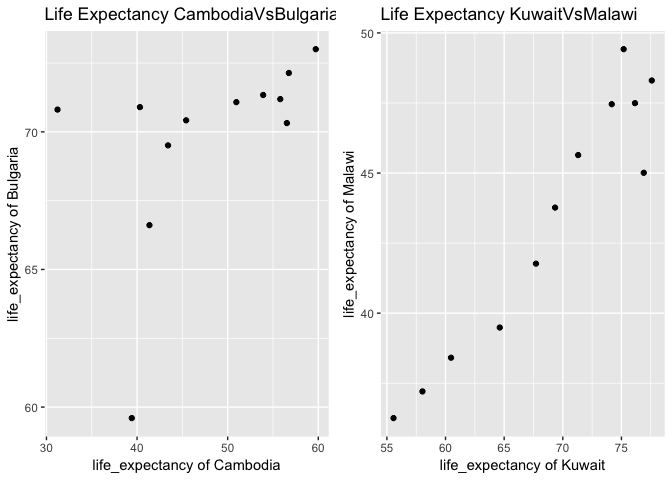

## Data Reshaping Prompt (and relationship to aggregation) 
Overview: Problem - You have data in one “shape” but you wish it were in another. Usually this is because the alternative shape is superior for presenting a table, making a figure, or doing aggregation and statistical analysis. 
          Solution: Reshape your data. For simple reshaping, gather() and spread() from tidyr will suffice. 

The dplyr library as a major component of the data analysis ecosystem. 

[](https://github.com/STAT545-UBC-students/hw04-rasiimwe/blob/master/plugins/dplyr.png)
          

### Activity #2
> Make a tibble with one row per year and columns for life expectancy for two or more countries.
> Use knitr::kable() to make this table look pretty in your rendered homework.
> Take advantage of this new data shape to scatterplot life expectancy for one country against that of another.

### Loading required packages for this assignment


```r
suppressPackageStartupMessages(library(tidyverse)) 
```

```
## Warning: package 'dplyr' was built under R version 3.5.1
```

```r
suppressPackageStartupMessages(library(gapminder))
suppressPackageStartupMessages(library(ggplot2))
suppressPackageStartupMessages(library(knitr))
suppressPackageStartupMessages(library(cowplot))
```
### Make a tibble with one row per year and columns for life expectancy for two or more countries.


```r
countries <- c("Cambodia", "Bulgaria","Malawi", "Kuwait")

life_expectancy <- gapminder %>%
  filter(country %in% countries) %>%
  select(country, year, lifeExp) %>%
  group_by(year) %>%
  spread(key = country, value = lifeExp)
```


### Use knitr::kable() to make this table look pretty in your rendered homework.


```r
kable(life_expectancy)
```


 year   Bulgaria   Cambodia   Kuwait   Malawi
-----  ---------  ---------  -------  -------
 1952     59.600     39.417   55.565   36.256
 1957     66.610     41.366   58.033   37.207
 1962     69.510     43.415   60.470   38.410
 1967     70.420     45.415   64.624   39.487
 1972     70.900     40.317   67.712   41.766
 1977     70.810     31.220   69.343   43.767
 1982     71.080     50.957   71.309   45.642
 1987     71.340     53.914   74.174   47.457
 1992     71.190     55.803   75.190   49.420
 1997     70.320     56.534   76.156   47.495
 2002     72.140     56.752   76.904   45.009
 2007     73.005     59.723   77.588   48.303

### Take advantage of this new data shape to scatterplot life expectancy for one country against that of another.


```r
 CambodiaVsBulgaria<- life_expectancy %>%
  ggplot(aes(Cambodia, Bulgaria)) +
  geom_point() + ggtitle("Life Expectancy") + theme_gray()+
  labs(title="Life Expectancy CambodiaVsBulgaria",x="life_expectancy of Cambodia", y="life_expectancy of Bulgaria")

 KuwaitVsMalawi<- life_expectancy %>%
  ggplot(aes(Kuwait, Malawi)) +
  geom_point() + ggtitle("Life Expectancy") + theme_gray()+
labs(title="Life Expectancy KuwaitVsMalawi ",x="life_expectancy of Kuwait", y="life_expectancy of Malawi")

plot_grid(CambodiaVsBulgaria,  KuwaitVsMalawi, nrow=1, ncol = 2)
```

<!-- -->


## Join Prompts (join, merge, look up)
Overview: Problem - You have two data sources and you need info from both in one new data object.
          Solution: Perform a join, which borrows terminology from the database world, specifically SQL.

### Activity #2 :Create your own cheatsheet 
> Create your own cheatsheet patterned after [Jenny’s](http://stat545.com/bit001_dplyr-cheatsheet.html) but focused on something you care about more than comics! Inspirational examples:
  + Pets I have owned + breed + friendly vs. unfriendly + ??. Join to a table of pet breed, including variables for furry vs not furry, mammal true or false, etc.
  + Movies and studios….
  + Athletes and teams….
You will likely need to iterate between your data prep and your joining to make your explorations comprehensive and interesting. For example, you will want a specific amount (or lack) of overlap between the two data.frames, in order to demonstrate all the different joins. You will want both the data frames to be as small as possible, while still retaining the expository value.

### Introduction to dplyr join functions

[](https://github.com/STAT545-UBC-students/hw04-rasiimwe/blob/master/plugins/join-venn.png)

Before we dig deeper into the various join functions, I will create the tibbles required to explore that application of these functions

### Creating tibble 1 
The idea and data used is derived from the wikipedia page of [preseidents of the United States](https://en.wikipedia.org/wiki/List_of_Presidents_of_the_United_States)


```r
presidents <- tibble(
  name = c("Donald Trump", "Barack Obama", "George W. Bush", "Bill Clinton","George H. W. Bush", "Ronald Reagan", "Jimmy Carter","Gerald Ford", "Richard Nixon"),
  previous_office = c("Chairman of The Trump Organization", "U.S. Senator from Illinois", "Governor of Texas", "Governor of Arkansas","Vice President of the United States", "Governor of California", "Governor of Georgia","Vice President of the United States", "Vice President of the United States"),
  party=c("Republican", "Democratic", "Republican", "Democratic","Republican", "Republican", "Democratic","Republican", "Republican"),
  in_office=c(2007, 2009, 2001, 1993,1989, 1981, 1977,1974, 1969),
  out_office=c("Incumbent", 2017, 2009, 2001,1993, 1989, 1981,1977, 1974)
)
```


### Creating tibble 2

```r
parties <- tibble(
  party=c("Republican", "Democratic", "Republican", "Democratic","Republican", "Republican", "Democratic","Republican", "Republican"),
  vice = c("Mike Pence", "Joe Biden", "Dick Cheney", "Al Gore","Dan Quayle", "George H. W. Bush", "Walter Mondale","Nelson Rockefeller", "Gerald Ford")
)
```


## Mutating joins:

**Joining tibbles using mutating functions:**

  1. `left_join`
  2. `right_join`
  3. `inner_join` 
  4. `full_join`


### Left Join

[](https://github.com/STAT545-UBC-students/hw04-rasiimwe/blob/master/plugins/left-join.gif)

**Basic syntax:** `left_join(x, y): keep all x, drop unmatched y`

**Join Function:** 

left_join(x, y): Return all rows from x, and all columns from x and y. If there are multiple matches between x and y, all combination of the matches are returned. This is a mutating join.

#### left_join on presidents & parties


```r
left_join(presidents, parties)
```

```
## Joining, by = "party"
```

<div data-pagedtable="false">
  <script data-pagedtable-source type="application/json">
{"columns":[{"label":["name"],"name":[1],"type":["chr"],"align":["left"]},{"label":["previous_office"],"name":[2],"type":["chr"],"align":["left"]},{"label":["party"],"name":[3],"type":["chr"],"align":["left"]},{"label":["in_office"],"name":[4],"type":["dbl"],"align":["right"]},{"label":["out_office"],"name":[5],"type":["chr"],"align":["left"]},{"label":["vice"],"name":[6],"type":["chr"],"align":["left"]}],"data":[{"1":"Donald Trump","2":"Chairman of The Trump Organization","3":"Republican","4":"2007","5":"Incumbent","6":"Mike Pence"},{"1":"Donald Trump","2":"Chairman of The Trump Organization","3":"Republican","4":"2007","5":"Incumbent","6":"Dick Cheney"},{"1":"Donald Trump","2":"Chairman of The Trump Organization","3":"Republican","4":"2007","5":"Incumbent","6":"Dan Quayle"},{"1":"Donald Trump","2":"Chairman of The Trump Organization","3":"Republican","4":"2007","5":"Incumbent","6":"George H. W. Bush"},{"1":"Donald Trump","2":"Chairman of The Trump Organization","3":"Republican","4":"2007","5":"Incumbent","6":"Nelson Rockefeller"},{"1":"Donald Trump","2":"Chairman of The Trump Organization","3":"Republican","4":"2007","5":"Incumbent","6":"Gerald Ford"},{"1":"Barack Obama","2":"U.S. Senator from Illinois","3":"Democratic","4":"2009","5":"2017","6":"Joe Biden"},{"1":"Barack Obama","2":"U.S. Senator from Illinois","3":"Democratic","4":"2009","5":"2017","6":"Al Gore"},{"1":"Barack Obama","2":"U.S. Senator from Illinois","3":"Democratic","4":"2009","5":"2017","6":"Walter Mondale"},{"1":"George W. Bush","2":"Governor of Texas","3":"Republican","4":"2001","5":"2009","6":"Mike Pence"},{"1":"George W. Bush","2":"Governor of Texas","3":"Republican","4":"2001","5":"2009","6":"Dick Cheney"},{"1":"George W. Bush","2":"Governor of Texas","3":"Republican","4":"2001","5":"2009","6":"Dan Quayle"},{"1":"George W. Bush","2":"Governor of Texas","3":"Republican","4":"2001","5":"2009","6":"George H. W. Bush"},{"1":"George W. Bush","2":"Governor of Texas","3":"Republican","4":"2001","5":"2009","6":"Nelson Rockefeller"},{"1":"George W. Bush","2":"Governor of Texas","3":"Republican","4":"2001","5":"2009","6":"Gerald Ford"},{"1":"Bill Clinton","2":"Governor of Arkansas","3":"Democratic","4":"1993","5":"2001","6":"Joe Biden"},{"1":"Bill Clinton","2":"Governor of Arkansas","3":"Democratic","4":"1993","5":"2001","6":"Al Gore"},{"1":"Bill Clinton","2":"Governor of Arkansas","3":"Democratic","4":"1993","5":"2001","6":"Walter Mondale"},{"1":"George H. W. Bush","2":"Vice President of the United States","3":"Republican","4":"1989","5":"1993","6":"Mike Pence"},{"1":"George H. W. Bush","2":"Vice President of the United States","3":"Republican","4":"1989","5":"1993","6":"Dick Cheney"},{"1":"George H. W. Bush","2":"Vice President of the United States","3":"Republican","4":"1989","5":"1993","6":"Dan Quayle"},{"1":"George H. W. Bush","2":"Vice President of the United States","3":"Republican","4":"1989","5":"1993","6":"George H. W. Bush"},{"1":"George H. W. Bush","2":"Vice President of the United States","3":"Republican","4":"1989","5":"1993","6":"Nelson Rockefeller"},{"1":"George H. W. Bush","2":"Vice President of the United States","3":"Republican","4":"1989","5":"1993","6":"Gerald Ford"},{"1":"Ronald Reagan","2":"Governor of California","3":"Republican","4":"1981","5":"1989","6":"Mike Pence"},{"1":"Ronald Reagan","2":"Governor of California","3":"Republican","4":"1981","5":"1989","6":"Dick Cheney"},{"1":"Ronald Reagan","2":"Governor of California","3":"Republican","4":"1981","5":"1989","6":"Dan Quayle"},{"1":"Ronald Reagan","2":"Governor of California","3":"Republican","4":"1981","5":"1989","6":"George H. W. Bush"},{"1":"Ronald Reagan","2":"Governor of California","3":"Republican","4":"1981","5":"1989","6":"Nelson Rockefeller"},{"1":"Ronald Reagan","2":"Governor of California","3":"Republican","4":"1981","5":"1989","6":"Gerald Ford"},{"1":"Jimmy Carter","2":"Governor of Georgia","3":"Democratic","4":"1977","5":"1981","6":"Joe Biden"},{"1":"Jimmy Carter","2":"Governor of Georgia","3":"Democratic","4":"1977","5":"1981","6":"Al Gore"},{"1":"Jimmy Carter","2":"Governor of Georgia","3":"Democratic","4":"1977","5":"1981","6":"Walter Mondale"},{"1":"Gerald Ford","2":"Vice President of the United States","3":"Republican","4":"1974","5":"1977","6":"Mike Pence"},{"1":"Gerald Ford","2":"Vice President of the United States","3":"Republican","4":"1974","5":"1977","6":"Dick Cheney"},{"1":"Gerald Ford","2":"Vice President of the United States","3":"Republican","4":"1974","5":"1977","6":"Dan Quayle"},{"1":"Gerald Ford","2":"Vice President of the United States","3":"Republican","4":"1974","5":"1977","6":"George H. W. Bush"},{"1":"Gerald Ford","2":"Vice President of the United States","3":"Republican","4":"1974","5":"1977","6":"Nelson Rockefeller"},{"1":"Gerald Ford","2":"Vice President of the United States","3":"Republican","4":"1974","5":"1977","6":"Gerald Ford"},{"1":"Richard Nixon","2":"Vice President of the United States","3":"Republican","4":"1969","5":"1974","6":"Mike Pence"},{"1":"Richard Nixon","2":"Vice President of the United States","3":"Republican","4":"1969","5":"1974","6":"Dick Cheney"},{"1":"Richard Nixon","2":"Vice President of the United States","3":"Republican","4":"1969","5":"1974","6":"Dan Quayle"},{"1":"Richard Nixon","2":"Vice President of the United States","3":"Republican","4":"1969","5":"1974","6":"George H. W. Bush"},{"1":"Richard Nixon","2":"Vice President of the United States","3":"Republican","4":"1969","5":"1974","6":"Nelson Rockefeller"},{"1":"Richard Nixon","2":"Vice President of the United States","3":"Republican","4":"1969","5":"1974","6":"Gerald Ford"}],"options":{"columns":{"min":{},"max":[10]},"rows":{"min":[10],"max":[10]},"pages":{}}}
  </script>
</div>


### Right Join

[](https://github.com/STAT545-UBC-students/hw04-rasiimwe/blob/master/plugins/right-join.gif)

**Basic syntax:** `right_join(x, y): keep all y, drop unmatched x`

#### right_join on presidents & parties


```r
right_join(presidents, parties)
```

```
## Joining, by = "party"
```

<div data-pagedtable="false">
  <script data-pagedtable-source type="application/json">
{"columns":[{"label":["name"],"name":[1],"type":["chr"],"align":["left"]},{"label":["previous_office"],"name":[2],"type":["chr"],"align":["left"]},{"label":["party"],"name":[3],"type":["chr"],"align":["left"]},{"label":["in_office"],"name":[4],"type":["dbl"],"align":["right"]},{"label":["out_office"],"name":[5],"type":["chr"],"align":["left"]},{"label":["vice"],"name":[6],"type":["chr"],"align":["left"]}],"data":[{"1":"Donald Trump","2":"Chairman of The Trump Organization","3":"Republican","4":"2007","5":"Incumbent","6":"Mike Pence"},{"1":"George W. Bush","2":"Governor of Texas","3":"Republican","4":"2001","5":"2009","6":"Mike Pence"},{"1":"George H. W. Bush","2":"Vice President of the United States","3":"Republican","4":"1989","5":"1993","6":"Mike Pence"},{"1":"Ronald Reagan","2":"Governor of California","3":"Republican","4":"1981","5":"1989","6":"Mike Pence"},{"1":"Gerald Ford","2":"Vice President of the United States","3":"Republican","4":"1974","5":"1977","6":"Mike Pence"},{"1":"Richard Nixon","2":"Vice President of the United States","3":"Republican","4":"1969","5":"1974","6":"Mike Pence"},{"1":"Barack Obama","2":"U.S. Senator from Illinois","3":"Democratic","4":"2009","5":"2017","6":"Joe Biden"},{"1":"Bill Clinton","2":"Governor of Arkansas","3":"Democratic","4":"1993","5":"2001","6":"Joe Biden"},{"1":"Jimmy Carter","2":"Governor of Georgia","3":"Democratic","4":"1977","5":"1981","6":"Joe Biden"},{"1":"Donald Trump","2":"Chairman of The Trump Organization","3":"Republican","4":"2007","5":"Incumbent","6":"Dick Cheney"},{"1":"George W. Bush","2":"Governor of Texas","3":"Republican","4":"2001","5":"2009","6":"Dick Cheney"},{"1":"George H. W. Bush","2":"Vice President of the United States","3":"Republican","4":"1989","5":"1993","6":"Dick Cheney"},{"1":"Ronald Reagan","2":"Governor of California","3":"Republican","4":"1981","5":"1989","6":"Dick Cheney"},{"1":"Gerald Ford","2":"Vice President of the United States","3":"Republican","4":"1974","5":"1977","6":"Dick Cheney"},{"1":"Richard Nixon","2":"Vice President of the United States","3":"Republican","4":"1969","5":"1974","6":"Dick Cheney"},{"1":"Barack Obama","2":"U.S. Senator from Illinois","3":"Democratic","4":"2009","5":"2017","6":"Al Gore"},{"1":"Bill Clinton","2":"Governor of Arkansas","3":"Democratic","4":"1993","5":"2001","6":"Al Gore"},{"1":"Jimmy Carter","2":"Governor of Georgia","3":"Democratic","4":"1977","5":"1981","6":"Al Gore"},{"1":"Donald Trump","2":"Chairman of The Trump Organization","3":"Republican","4":"2007","5":"Incumbent","6":"Dan Quayle"},{"1":"George W. Bush","2":"Governor of Texas","3":"Republican","4":"2001","5":"2009","6":"Dan Quayle"},{"1":"George H. W. Bush","2":"Vice President of the United States","3":"Republican","4":"1989","5":"1993","6":"Dan Quayle"},{"1":"Ronald Reagan","2":"Governor of California","3":"Republican","4":"1981","5":"1989","6":"Dan Quayle"},{"1":"Gerald Ford","2":"Vice President of the United States","3":"Republican","4":"1974","5":"1977","6":"Dan Quayle"},{"1":"Richard Nixon","2":"Vice President of the United States","3":"Republican","4":"1969","5":"1974","6":"Dan Quayle"},{"1":"Donald Trump","2":"Chairman of The Trump Organization","3":"Republican","4":"2007","5":"Incumbent","6":"George H. W. Bush"},{"1":"George W. Bush","2":"Governor of Texas","3":"Republican","4":"2001","5":"2009","6":"George H. W. Bush"},{"1":"George H. W. Bush","2":"Vice President of the United States","3":"Republican","4":"1989","5":"1993","6":"George H. W. Bush"},{"1":"Ronald Reagan","2":"Governor of California","3":"Republican","4":"1981","5":"1989","6":"George H. W. Bush"},{"1":"Gerald Ford","2":"Vice President of the United States","3":"Republican","4":"1974","5":"1977","6":"George H. W. Bush"},{"1":"Richard Nixon","2":"Vice President of the United States","3":"Republican","4":"1969","5":"1974","6":"George H. W. Bush"},{"1":"Barack Obama","2":"U.S. Senator from Illinois","3":"Democratic","4":"2009","5":"2017","6":"Walter Mondale"},{"1":"Bill Clinton","2":"Governor of Arkansas","3":"Democratic","4":"1993","5":"2001","6":"Walter Mondale"},{"1":"Jimmy Carter","2":"Governor of Georgia","3":"Democratic","4":"1977","5":"1981","6":"Walter Mondale"},{"1":"Donald Trump","2":"Chairman of The Trump Organization","3":"Republican","4":"2007","5":"Incumbent","6":"Nelson Rockefeller"},{"1":"George W. Bush","2":"Governor of Texas","3":"Republican","4":"2001","5":"2009","6":"Nelson Rockefeller"},{"1":"George H. W. Bush","2":"Vice President of the United States","3":"Republican","4":"1989","5":"1993","6":"Nelson Rockefeller"},{"1":"Ronald Reagan","2":"Governor of California","3":"Republican","4":"1981","5":"1989","6":"Nelson Rockefeller"},{"1":"Gerald Ford","2":"Vice President of the United States","3":"Republican","4":"1974","5":"1977","6":"Nelson Rockefeller"},{"1":"Richard Nixon","2":"Vice President of the United States","3":"Republican","4":"1969","5":"1974","6":"Nelson Rockefeller"},{"1":"Donald Trump","2":"Chairman of The Trump Organization","3":"Republican","4":"2007","5":"Incumbent","6":"Gerald Ford"},{"1":"George W. Bush","2":"Governor of Texas","3":"Republican","4":"2001","5":"2009","6":"Gerald Ford"},{"1":"George H. W. Bush","2":"Vice President of the United States","3":"Republican","4":"1989","5":"1993","6":"Gerald Ford"},{"1":"Ronald Reagan","2":"Governor of California","3":"Republican","4":"1981","5":"1989","6":"Gerald Ford"},{"1":"Gerald Ford","2":"Vice President of the United States","3":"Republican","4":"1974","5":"1977","6":"Gerald Ford"},{"1":"Richard Nixon","2":"Vice President of the United States","3":"Republican","4":"1969","5":"1974","6":"Gerald Ford"}],"options":{"columns":{"min":{},"max":[10]},"rows":{"min":[10],"max":[10]},"pages":{}}}
  </script>
</div>


### Inner Join

[](https://github.com/STAT545-UBC-students/hw04-rasiimwe/blob/master/plugins/inner-join.gif)

**Basic syntax:** `inner_join(x, y): keep only matching`

**Join Function:** 

inner_join(x, y): Return all rows from x where there are matching values in y, and all columns from x and y. If there are multiple matches between x and y, all combination of the matches are returned. This is a mutating join.

#### inner_join on presidents & parties


```r
inner_join(presidents, parties)
```

```
## Joining, by = "party"
```

<div data-pagedtable="false">
  <script data-pagedtable-source type="application/json">
{"columns":[{"label":["name"],"name":[1],"type":["chr"],"align":["left"]},{"label":["previous_office"],"name":[2],"type":["chr"],"align":["left"]},{"label":["party"],"name":[3],"type":["chr"],"align":["left"]},{"label":["in_office"],"name":[4],"type":["dbl"],"align":["right"]},{"label":["out_office"],"name":[5],"type":["chr"],"align":["left"]},{"label":["vice"],"name":[6],"type":["chr"],"align":["left"]}],"data":[{"1":"Donald Trump","2":"Chairman of The Trump Organization","3":"Republican","4":"2007","5":"Incumbent","6":"Mike Pence"},{"1":"Donald Trump","2":"Chairman of The Trump Organization","3":"Republican","4":"2007","5":"Incumbent","6":"Dick Cheney"},{"1":"Donald Trump","2":"Chairman of The Trump Organization","3":"Republican","4":"2007","5":"Incumbent","6":"Dan Quayle"},{"1":"Donald Trump","2":"Chairman of The Trump Organization","3":"Republican","4":"2007","5":"Incumbent","6":"George H. W. Bush"},{"1":"Donald Trump","2":"Chairman of The Trump Organization","3":"Republican","4":"2007","5":"Incumbent","6":"Nelson Rockefeller"},{"1":"Donald Trump","2":"Chairman of The Trump Organization","3":"Republican","4":"2007","5":"Incumbent","6":"Gerald Ford"},{"1":"Barack Obama","2":"U.S. Senator from Illinois","3":"Democratic","4":"2009","5":"2017","6":"Joe Biden"},{"1":"Barack Obama","2":"U.S. Senator from Illinois","3":"Democratic","4":"2009","5":"2017","6":"Al Gore"},{"1":"Barack Obama","2":"U.S. Senator from Illinois","3":"Democratic","4":"2009","5":"2017","6":"Walter Mondale"},{"1":"George W. Bush","2":"Governor of Texas","3":"Republican","4":"2001","5":"2009","6":"Mike Pence"},{"1":"George W. Bush","2":"Governor of Texas","3":"Republican","4":"2001","5":"2009","6":"Dick Cheney"},{"1":"George W. Bush","2":"Governor of Texas","3":"Republican","4":"2001","5":"2009","6":"Dan Quayle"},{"1":"George W. Bush","2":"Governor of Texas","3":"Republican","4":"2001","5":"2009","6":"George H. W. Bush"},{"1":"George W. Bush","2":"Governor of Texas","3":"Republican","4":"2001","5":"2009","6":"Nelson Rockefeller"},{"1":"George W. Bush","2":"Governor of Texas","3":"Republican","4":"2001","5":"2009","6":"Gerald Ford"},{"1":"Bill Clinton","2":"Governor of Arkansas","3":"Democratic","4":"1993","5":"2001","6":"Joe Biden"},{"1":"Bill Clinton","2":"Governor of Arkansas","3":"Democratic","4":"1993","5":"2001","6":"Al Gore"},{"1":"Bill Clinton","2":"Governor of Arkansas","3":"Democratic","4":"1993","5":"2001","6":"Walter Mondale"},{"1":"George H. W. Bush","2":"Vice President of the United States","3":"Republican","4":"1989","5":"1993","6":"Mike Pence"},{"1":"George H. W. Bush","2":"Vice President of the United States","3":"Republican","4":"1989","5":"1993","6":"Dick Cheney"},{"1":"George H. W. Bush","2":"Vice President of the United States","3":"Republican","4":"1989","5":"1993","6":"Dan Quayle"},{"1":"George H. W. Bush","2":"Vice President of the United States","3":"Republican","4":"1989","5":"1993","6":"George H. W. Bush"},{"1":"George H. W. Bush","2":"Vice President of the United States","3":"Republican","4":"1989","5":"1993","6":"Nelson Rockefeller"},{"1":"George H. W. Bush","2":"Vice President of the United States","3":"Republican","4":"1989","5":"1993","6":"Gerald Ford"},{"1":"Ronald Reagan","2":"Governor of California","3":"Republican","4":"1981","5":"1989","6":"Mike Pence"},{"1":"Ronald Reagan","2":"Governor of California","3":"Republican","4":"1981","5":"1989","6":"Dick Cheney"},{"1":"Ronald Reagan","2":"Governor of California","3":"Republican","4":"1981","5":"1989","6":"Dan Quayle"},{"1":"Ronald Reagan","2":"Governor of California","3":"Republican","4":"1981","5":"1989","6":"George H. W. Bush"},{"1":"Ronald Reagan","2":"Governor of California","3":"Republican","4":"1981","5":"1989","6":"Nelson Rockefeller"},{"1":"Ronald Reagan","2":"Governor of California","3":"Republican","4":"1981","5":"1989","6":"Gerald Ford"},{"1":"Jimmy Carter","2":"Governor of Georgia","3":"Democratic","4":"1977","5":"1981","6":"Joe Biden"},{"1":"Jimmy Carter","2":"Governor of Georgia","3":"Democratic","4":"1977","5":"1981","6":"Al Gore"},{"1":"Jimmy Carter","2":"Governor of Georgia","3":"Democratic","4":"1977","5":"1981","6":"Walter Mondale"},{"1":"Gerald Ford","2":"Vice President of the United States","3":"Republican","4":"1974","5":"1977","6":"Mike Pence"},{"1":"Gerald Ford","2":"Vice President of the United States","3":"Republican","4":"1974","5":"1977","6":"Dick Cheney"},{"1":"Gerald Ford","2":"Vice President of the United States","3":"Republican","4":"1974","5":"1977","6":"Dan Quayle"},{"1":"Gerald Ford","2":"Vice President of the United States","3":"Republican","4":"1974","5":"1977","6":"George H. W. Bush"},{"1":"Gerald Ford","2":"Vice President of the United States","3":"Republican","4":"1974","5":"1977","6":"Nelson Rockefeller"},{"1":"Gerald Ford","2":"Vice President of the United States","3":"Republican","4":"1974","5":"1977","6":"Gerald Ford"},{"1":"Richard Nixon","2":"Vice President of the United States","3":"Republican","4":"1969","5":"1974","6":"Mike Pence"},{"1":"Richard Nixon","2":"Vice President of the United States","3":"Republican","4":"1969","5":"1974","6":"Dick Cheney"},{"1":"Richard Nixon","2":"Vice President of the United States","3":"Republican","4":"1969","5":"1974","6":"Dan Quayle"},{"1":"Richard Nixon","2":"Vice President of the United States","3":"Republican","4":"1969","5":"1974","6":"George H. W. Bush"},{"1":"Richard Nixon","2":"Vice President of the United States","3":"Republican","4":"1969","5":"1974","6":"Nelson Rockefeller"},{"1":"Richard Nixon","2":"Vice President of the United States","3":"Republican","4":"1969","5":"1974","6":"Gerald Ford"}],"options":{"columns":{"min":{},"max":[10]},"rows":{"min":[10],"max":[10]},"pages":{}}}
  </script>
</div>

### Full Join

[](https://github.com/STAT545-UBC-students/hw04-rasiimwe/blob/master/plugins/full-join.gif)

**Basic syntax:** `full_join(x, y): keep everything`

**Join Function:** 

full_join(x, y): Return all rows and all columns from both x and y. Where there are not matching values, returns NA for the one missing. This is a mutating join.

#### full_join on presidents & parties


```r
full_join(presidents, parties)
```

```
## Joining, by = "party"
```

<div data-pagedtable="false">
  <script data-pagedtable-source type="application/json">
{"columns":[{"label":["name"],"name":[1],"type":["chr"],"align":["left"]},{"label":["previous_office"],"name":[2],"type":["chr"],"align":["left"]},{"label":["party"],"name":[3],"type":["chr"],"align":["left"]},{"label":["in_office"],"name":[4],"type":["dbl"],"align":["right"]},{"label":["out_office"],"name":[5],"type":["chr"],"align":["left"]},{"label":["vice"],"name":[6],"type":["chr"],"align":["left"]}],"data":[{"1":"Donald Trump","2":"Chairman of The Trump Organization","3":"Republican","4":"2007","5":"Incumbent","6":"Mike Pence"},{"1":"Donald Trump","2":"Chairman of The Trump Organization","3":"Republican","4":"2007","5":"Incumbent","6":"Dick Cheney"},{"1":"Donald Trump","2":"Chairman of The Trump Organization","3":"Republican","4":"2007","5":"Incumbent","6":"Dan Quayle"},{"1":"Donald Trump","2":"Chairman of The Trump Organization","3":"Republican","4":"2007","5":"Incumbent","6":"George H. W. Bush"},{"1":"Donald Trump","2":"Chairman of The Trump Organization","3":"Republican","4":"2007","5":"Incumbent","6":"Nelson Rockefeller"},{"1":"Donald Trump","2":"Chairman of The Trump Organization","3":"Republican","4":"2007","5":"Incumbent","6":"Gerald Ford"},{"1":"Barack Obama","2":"U.S. Senator from Illinois","3":"Democratic","4":"2009","5":"2017","6":"Joe Biden"},{"1":"Barack Obama","2":"U.S. Senator from Illinois","3":"Democratic","4":"2009","5":"2017","6":"Al Gore"},{"1":"Barack Obama","2":"U.S. Senator from Illinois","3":"Democratic","4":"2009","5":"2017","6":"Walter Mondale"},{"1":"George W. Bush","2":"Governor of Texas","3":"Republican","4":"2001","5":"2009","6":"Mike Pence"},{"1":"George W. Bush","2":"Governor of Texas","3":"Republican","4":"2001","5":"2009","6":"Dick Cheney"},{"1":"George W. Bush","2":"Governor of Texas","3":"Republican","4":"2001","5":"2009","6":"Dan Quayle"},{"1":"George W. Bush","2":"Governor of Texas","3":"Republican","4":"2001","5":"2009","6":"George H. W. Bush"},{"1":"George W. Bush","2":"Governor of Texas","3":"Republican","4":"2001","5":"2009","6":"Nelson Rockefeller"},{"1":"George W. Bush","2":"Governor of Texas","3":"Republican","4":"2001","5":"2009","6":"Gerald Ford"},{"1":"Bill Clinton","2":"Governor of Arkansas","3":"Democratic","4":"1993","5":"2001","6":"Joe Biden"},{"1":"Bill Clinton","2":"Governor of Arkansas","3":"Democratic","4":"1993","5":"2001","6":"Al Gore"},{"1":"Bill Clinton","2":"Governor of Arkansas","3":"Democratic","4":"1993","5":"2001","6":"Walter Mondale"},{"1":"George H. W. Bush","2":"Vice President of the United States","3":"Republican","4":"1989","5":"1993","6":"Mike Pence"},{"1":"George H. W. Bush","2":"Vice President of the United States","3":"Republican","4":"1989","5":"1993","6":"Dick Cheney"},{"1":"George H. W. Bush","2":"Vice President of the United States","3":"Republican","4":"1989","5":"1993","6":"Dan Quayle"},{"1":"George H. W. Bush","2":"Vice President of the United States","3":"Republican","4":"1989","5":"1993","6":"George H. W. Bush"},{"1":"George H. W. Bush","2":"Vice President of the United States","3":"Republican","4":"1989","5":"1993","6":"Nelson Rockefeller"},{"1":"George H. W. Bush","2":"Vice President of the United States","3":"Republican","4":"1989","5":"1993","6":"Gerald Ford"},{"1":"Ronald Reagan","2":"Governor of California","3":"Republican","4":"1981","5":"1989","6":"Mike Pence"},{"1":"Ronald Reagan","2":"Governor of California","3":"Republican","4":"1981","5":"1989","6":"Dick Cheney"},{"1":"Ronald Reagan","2":"Governor of California","3":"Republican","4":"1981","5":"1989","6":"Dan Quayle"},{"1":"Ronald Reagan","2":"Governor of California","3":"Republican","4":"1981","5":"1989","6":"George H. W. Bush"},{"1":"Ronald Reagan","2":"Governor of California","3":"Republican","4":"1981","5":"1989","6":"Nelson Rockefeller"},{"1":"Ronald Reagan","2":"Governor of California","3":"Republican","4":"1981","5":"1989","6":"Gerald Ford"},{"1":"Jimmy Carter","2":"Governor of Georgia","3":"Democratic","4":"1977","5":"1981","6":"Joe Biden"},{"1":"Jimmy Carter","2":"Governor of Georgia","3":"Democratic","4":"1977","5":"1981","6":"Al Gore"},{"1":"Jimmy Carter","2":"Governor of Georgia","3":"Democratic","4":"1977","5":"1981","6":"Walter Mondale"},{"1":"Gerald Ford","2":"Vice President of the United States","3":"Republican","4":"1974","5":"1977","6":"Mike Pence"},{"1":"Gerald Ford","2":"Vice President of the United States","3":"Republican","4":"1974","5":"1977","6":"Dick Cheney"},{"1":"Gerald Ford","2":"Vice President of the United States","3":"Republican","4":"1974","5":"1977","6":"Dan Quayle"},{"1":"Gerald Ford","2":"Vice President of the United States","3":"Republican","4":"1974","5":"1977","6":"George H. W. Bush"},{"1":"Gerald Ford","2":"Vice President of the United States","3":"Republican","4":"1974","5":"1977","6":"Nelson Rockefeller"},{"1":"Gerald Ford","2":"Vice President of the United States","3":"Republican","4":"1974","5":"1977","6":"Gerald Ford"},{"1":"Richard Nixon","2":"Vice President of the United States","3":"Republican","4":"1969","5":"1974","6":"Mike Pence"},{"1":"Richard Nixon","2":"Vice President of the United States","3":"Republican","4":"1969","5":"1974","6":"Dick Cheney"},{"1":"Richard Nixon","2":"Vice President of the United States","3":"Republican","4":"1969","5":"1974","6":"Dan Quayle"},{"1":"Richard Nixon","2":"Vice President of the United States","3":"Republican","4":"1969","5":"1974","6":"George H. W. Bush"},{"1":"Richard Nixon","2":"Vice President of the United States","3":"Republican","4":"1969","5":"1974","6":"Nelson Rockefeller"},{"1":"Richard Nixon","2":"Vice President of the United States","3":"Republican","4":"1969","5":"1974","6":"Gerald Ford"}],"options":{"columns":{"min":{},"max":[10]},"rows":{"min":[10],"max":[10]},"pages":{}}}
  </script>
</div>

## Filtering joins:

**Joining tibbles using filtering functions:** 

  1. `semi_join`
  2. `anti_join`

### Semi Join

[](https://github.com/STAT545-UBC-students/hw04-rasiimwe/blob/master/plugins/semi-join.gif)

**Basic syntax:** `semi_join(x, y): return rows from x where there are matching values in y`

**Join Function:** 

semi_join(x, y): Return all rows from x where there are matching values in y, keeping just columns from x. A semi join differs from an inner join because an inner join will return one row of x for each matching row of y, where a semi join will never duplicate rows of x. This is a filtering join.


#### semi_join on presidents & parties


```r
semi_join(presidents, parties)
```

```
## Joining, by = "party"
```

<div data-pagedtable="false">
  <script data-pagedtable-source type="application/json">
{"columns":[{"label":["name"],"name":[1],"type":["chr"],"align":["left"]},{"label":["previous_office"],"name":[2],"type":["chr"],"align":["left"]},{"label":["party"],"name":[3],"type":["chr"],"align":["left"]},{"label":["in_office"],"name":[4],"type":["dbl"],"align":["right"]},{"label":["out_office"],"name":[5],"type":["chr"],"align":["left"]}],"data":[{"1":"Donald Trump","2":"Chairman of The Trump Organization","3":"Republican","4":"2007","5":"Incumbent"},{"1":"Barack Obama","2":"U.S. Senator from Illinois","3":"Democratic","4":"2009","5":"2017"},{"1":"George W. Bush","2":"Governor of Texas","3":"Republican","4":"2001","5":"2009"},{"1":"Bill Clinton","2":"Governor of Arkansas","3":"Democratic","4":"1993","5":"2001"},{"1":"George H. W. Bush","2":"Vice President of the United States","3":"Republican","4":"1989","5":"1993"},{"1":"Ronald Reagan","2":"Governor of California","3":"Republican","4":"1981","5":"1989"},{"1":"Jimmy Carter","2":"Governor of Georgia","3":"Democratic","4":"1977","5":"1981"},{"1":"Gerald Ford","2":"Vice President of the United States","3":"Republican","4":"1974","5":"1977"},{"1":"Richard Nixon","2":"Vice President of the United States","3":"Republican","4":"1969","5":"1974"}],"options":{"columns":{"min":{},"max":[10]},"rows":{"min":[10],"max":[10]},"pages":{}}}
  </script>
</div>


### Anti Join

[](https://github.com/STAT545-UBC-students/hw04-rasiimwe/blob/master/plugins/anti-join.gif)

anti_join(x, y): Return all rows from x where there are not matching values in y, keeping just columns from x. This is a filtering join.

#### anti_join on presidents & parties


```r
anti_join(presidents, parties)
```

```
## Joining, by = "party"
```

<div data-pagedtable="false">
  <script data-pagedtable-source type="application/json">
{"columns":[{"label":["name"],"name":[1],"type":["chr"],"align":["left"]},{"label":["previous_office"],"name":[2],"type":["chr"],"align":["left"]},{"label":["party"],"name":[3],"type":["chr"],"align":["left"]},{"label":["in_office"],"name":[4],"type":["dbl"],"align":["right"]},{"label":["out_office"],"name":[5],"type":["chr"],"align":["left"]}],"data":[],"options":{"columns":{"min":{},"max":[10]},"rows":{"min":[10],"max":[10]},"pages":{}}}
  </script>
</div>

## Set Operations:

**Functions used for set operations on two tibbles:**

  1. `intersect`
  2. `union`
  3. `setdiff`

## Biding datasets:

  1. `bind_rows` 
  2. `bind cols`


---

### Sources to acknowledge:

[STAT545 Class notes and excercises by Rashedul Islam](https://github.com/rasiimwe/STAT545_participation/blob/master/cm010/cm010-exercise.md)

[Jenny Bryan's Cheatsheet for dplyr join functions](http://stat545.com/bit001_dplyr-cheatsheet.html)

[Garrick Aden-Buie's tidy verbs](https://github.com/gadenbuie/tidyexplain#readme)
